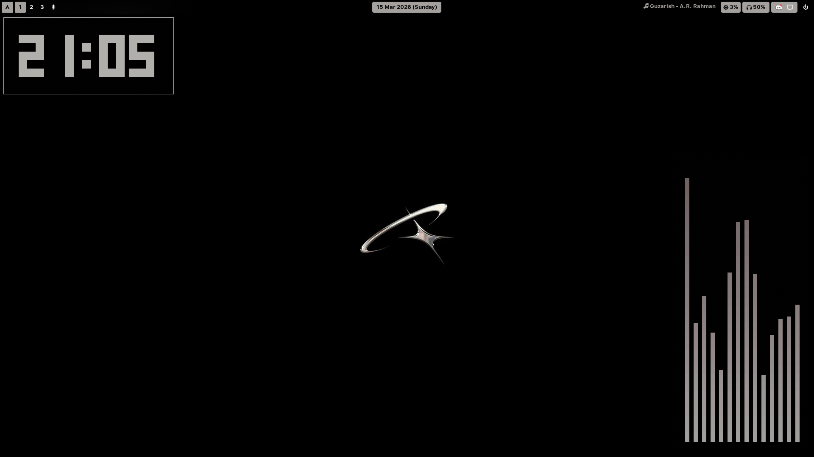
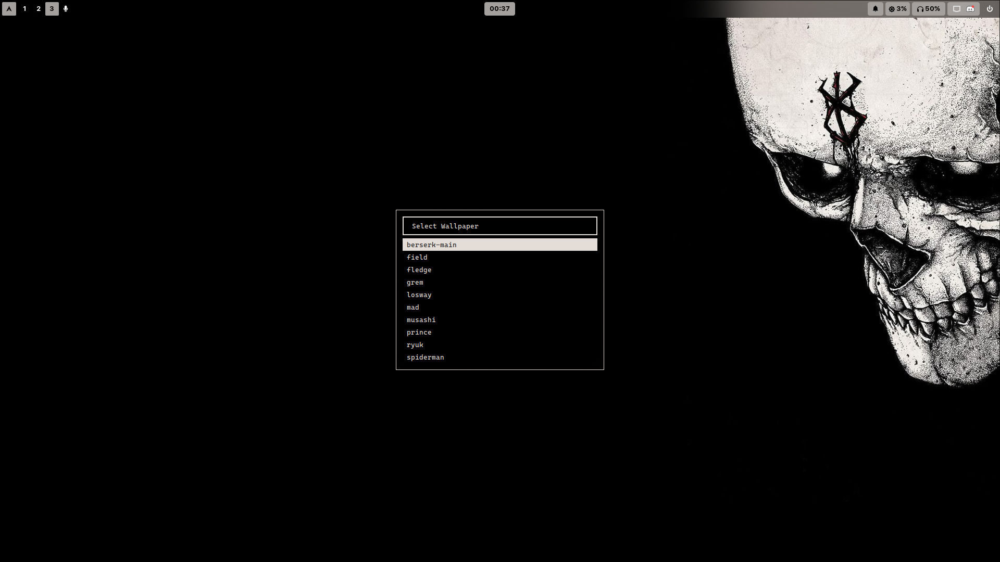
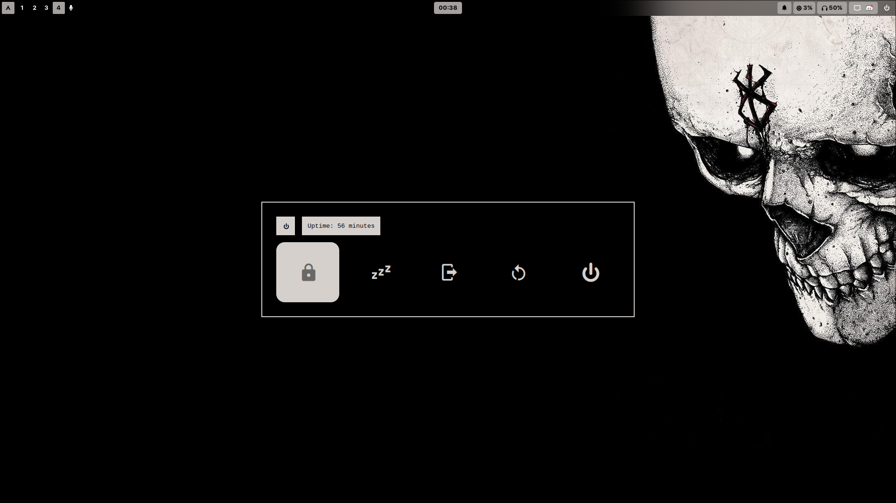
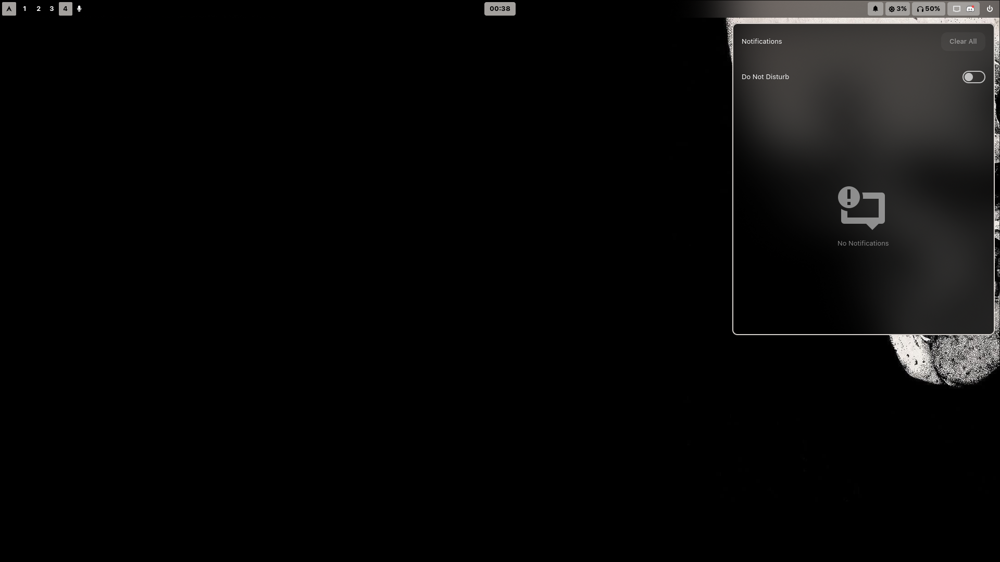
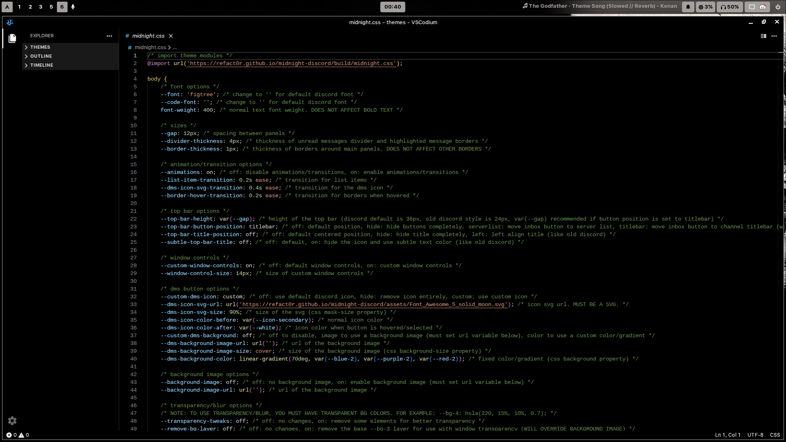
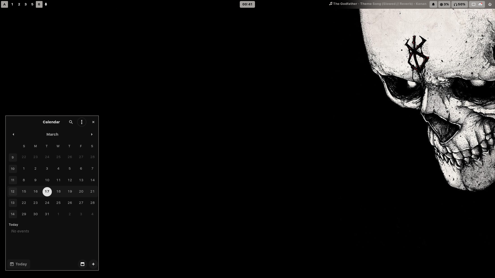
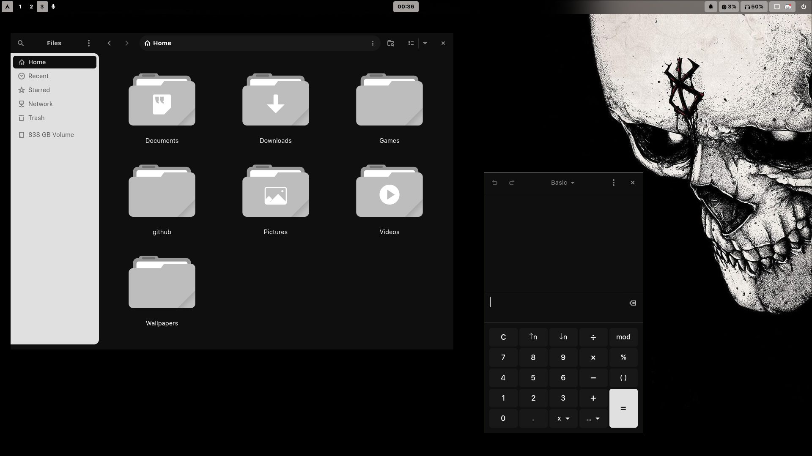

# HyprZark — An Arch Linux Hyprland Rice

## Screenshots











## What is HyprZark?

HyprZark takes the minimalist spirit of the original Zark i3 rice and brings it to **Hyprland** — a dynamic tiling Wayland compositor known for its smooth animations and modern feature set. While Zark was clean and functional, HyprZark goes further: better visuals, richer configuration, more thoughtful defaults, and a setup that feels like a cohesive desktop environment rather than a patched-together window manager setup.

If you loved Zark, you'll feel right at home. If you're new — welcome to your new daily driver.

---

## Features

- **Window Manager**: Hyprland (Wayland)
- **Status Bar**: Waybar
- **Application Launcher**: Rofi
- **Terminal**: Kitty
- **Notifications**: SwayNC
- **Audio Visualizer**: Cava
- **Shell**: Zsh with Oh My Zsh
- **File Manager**: Ranger
- **System Info**: Fastfetch

---

## Installation

HyprZark is designed for a **fresh Arch Linux installation**.

### Prerequisites

- Fresh Arch Linux install
- Internet connection
- That's it — the script handles the rest

### Install

1. Clone the repository:
```bash
git clone https://github.com/aeneex/hyprzark.git
cd hyprzark
```

2. Make the install script executable and run it:
```bash
chmod +x install.sh
./install.sh
```

The script will automatically:
- Update your system
- Install `yay` (AUR helper)
- Install all required packages
- Run `setup.sh` to deploy all configuration files

> You only need to run `install.sh` — it takes care of everything including calling `setup.sh` on its own.

3. Reboot for everything to take effect.

---

## What Gets Installed

### Core Packages
- `hyprland`, `waybar`, `rofi`, `kitty`
- `swaync`, `cava`, `fastfetch`
- `zsh`, `oh-my-zsh`
- `ranger`, `fzf`, `eza`, `unzip`
- `nsxiv`, `neovim`, `mpv`

### Basic Packages
- `gnome-calculator`, `gnome-calendar`
- `nwg-look`, `btop`

### AUR Packages
- `brave-bin`

---

## Fonts

Custom fonts are installed to `/usr/share/fonts/`:

| Font | Usage |
|------|-------|
| **Caskaydia Cove Nerd Font** | Terminal & code |
| **Cousine Nerd Font** | UI elements |
| **Noto Color Emoji** | Emoji support across the desktop |
| **SF UI Text** | General UI text |

---

## Configuration

All configs land in `~/.config/` after setup:

| Component | Path |
|-----------|------|
| Hyprland | `~/.config/hypr/` |
| Waybar | `~/.config/waybar/` |
| Kitty | `~/.config/kitty/` |
| Rofi | `~/.config/rofi/` |
| SwayNC | `~/.config/swaync/` |
| Cava | `~/.config/cava/` |
| Ranger | `~/.config/ranger/` |

Zsh configuration lives at `~/.zshrc`

---

## Post-Install (Recommended)

The repo doesn't ship with the GTK theme and icon pack used in the screenshots. You can grab them here:
- GTK Theme: [graphite-gtk-theme](https://github.com/vinceliuice/Graphite-gtk-theme)
- Icons: [tela-circle-icons](https://github.com/vinceliuice/Tela-circle-icon-theme)

---

## Notes

- Built on Wayland — no X11 required
- Smooth Hyprland animations out of the box
- Designed to feel like a complete desktop environment, not just a WM config
- All configs are clean, well-structured, and easy to modify
- Minimal bloat, maximum intentionality

---

## Credits

HyprZark — built with ☕, patience, and a lot of `hyprctl reload`

## License

Feel free to use, modify, and distribute as you wish.
